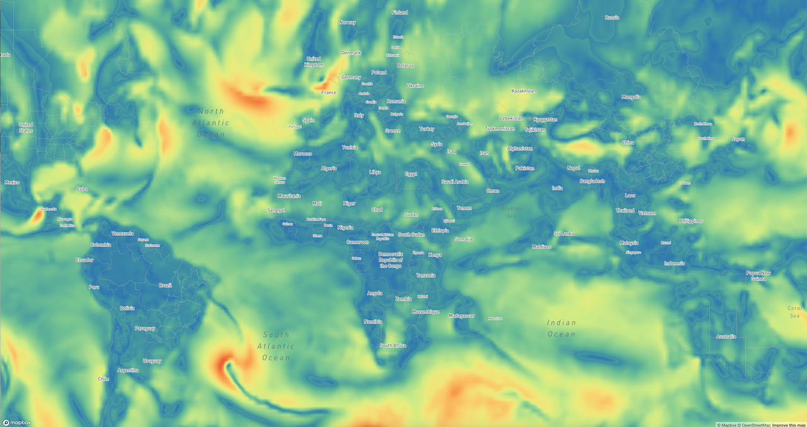
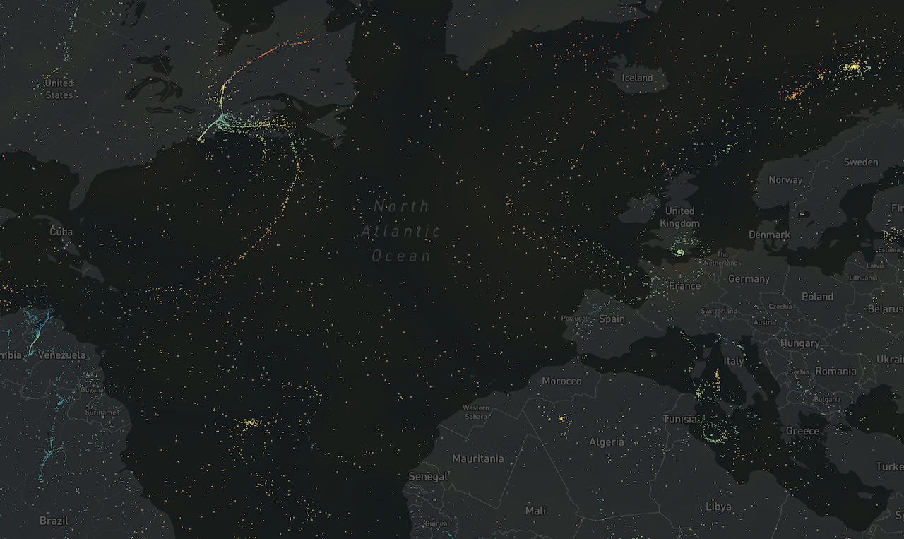
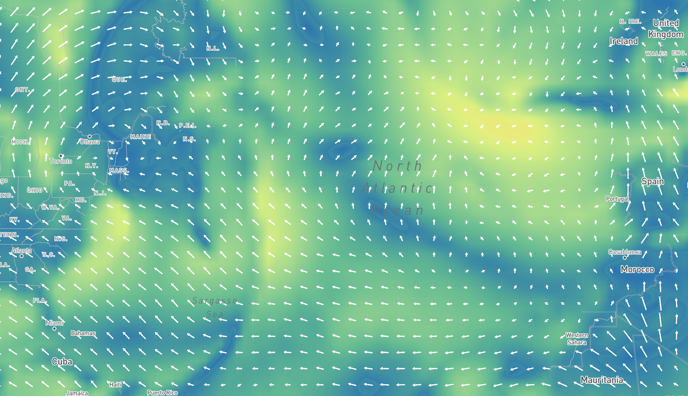

# WindGL

A WebGL-powered visualization of wind power using custom Mapbox Layers.
Capable of rendering up to 1 million wind particles at 60fps.

## Project Status

The author, @gampleman no longer works at @astrosat. As such, this project will no longer recieve maintenance from him. 
Furthermore, this project is not production ready, as there are a [number of bugs](https://github.com/astrosat/windgl/issues). 
If you wish to make use of this project, consider:

1. Getting in touch with @astrosat to discuss comercial support.
2. Getting in touch with @gampleman to discuss a consulting arrangement.
3. Forking this repository and fixing all issues. You are welcome to submit patches here, but please do not expect a speedy review.

As such, the project is currently a nice technical demo, but you should expect putting in significant resources if you wish to make a production implementation.

## Usage

```sh
npm install --save @astrosat/windgl
```

```javascript
import {Map} from 'mapboxgl';
import {sampleFill, particles, source, arrows} from '@astrosat/windgl';

// 1. Create a source
const windSource = source('http://url/to/backend');

const map = new Map(...);

map.addLayer(sampleFill({
  id: 'windbackground', // required
  source: windSource, // required
  'sample-fill-opacity': 0.8 // optional
}));

map.addLayer(particles({
  id: 'particles',
  source: windSource, // best to share the same source between all layers
  'particle-speed': ['interpolate', ['zoom'], 0, 0.5, 10, 0.8]
  // you can use mapbox style expressions
}));

map.addLayer(arrows({
    id: 'arrows',
    source: windSource
}), "waterway-label"); // inserting the layer in the middle of the layer stack is supported
```

## Layers

This package offers several ways to visualize wind speed.

### Sample Fill



This layer will use a color map to show the wind speed at each pixel (interpolated from the data set). You can customize it with the following properties:

#### `sample-fill-color`

A `color` value. You can interpolate based on zoom or using data-driven styling (`["get", "speed"]` will get the speed at the current pixel). The default value is a nice color scale:

```json
[
  "interpolate",
  ["linear"],
  ["get", "speed"],
  0.0,
  "#3288bd",
  10,
  "#66c2a5",
  20,
  "#abdda4",
  30,
  "#e6f598",
  40,
  "#fee08b",
  50,
  "#fdae61",
  60,
  "#f46d43",
  100.0,
  "#d53e4f"
]
```

#### `sample-opacity`

A `number` between `0` and `1`. Indicates the global opacity of the layer. You can use zoom for styling.

### Particles



A particle layer showing wind speed by animating particles based on the wind speed. You can customize it with the following properties:

#### `particle-color`

A `color` value. You can interpolate based on zoom or using data-driven styling (`["get", "speed"]` will get the speed at the current particle). The default value is `white`.

#### `particle-speed`

A positive `number`. Indicates how quickly the particles move (i.e. is a multiplier for the speed vector from the dataset). Can be interpolated based on zoom levels. Default is `0.75`.

You can adjust the properties by calling `setProperty(property, value)`.

### Arrows



A vector field layer. You can customize it with the following properties:

#### `arrow-min-size`

A positive `number`. In general, this layer will attempt to draw an arrow at every grid point of the underlying data. However, sometimes that would result in really tiny arrows. So if the size of the arrow would be less than this limit, we will switch to interpolation and show a larger arrow aggregating multiple values. Default is 40px.

#### `arrow-color`

A `color` value. You can interpolate based on zoom or using data-driven styling (`["get", "speed"]` will get the speed at the current grid point). The default value is `white`.

#### `arrow-halo-color`

A `color` value. You can interpolate based on zoom. The color of an outline drawn around the arrow. Defaults to transparent.

## Data

This visualization is designed to visualize wind speed data based on a regular grid - such that is typically available from forecast models. This data is encoded in a texture in [plate carrée](https://en.wikipedia.org/wiki/Equirectangular_projection) projection where the R channel corresponds to x (or u), and the G channel corresponds to y (or v). However, these encodings are relative to the total observed range which must be encoded in an accompanying JSON file:

```json
{
  "source": "http://nomads.ncep.noaa.gov",
  "date": "2016-11-20T00:00Z",
  "width": 360,
  "height": 180,
  "uMin": -21.32,
  "uMax": 26.8,
  "vMin": -21.57,
  "vMax": 21.42,
  "tiles": ["https://example.com/demo/wind/{z}/{x}/{y}.png"]
}
```

The format is designed for tiling, but this hasn't been implemented in the visualization yet.

You can use the provided tool to get the data. Simply go to the `data` directory, create a python virtualenv with dependencies using Pipenv and the provided pipfile. Then run `gfswind2png.py --help` for instructions.

## Acknowledgments

This code started as a fork of [mapbox/webgl-wind](https://github.com/mapbox/webgl-wind).
